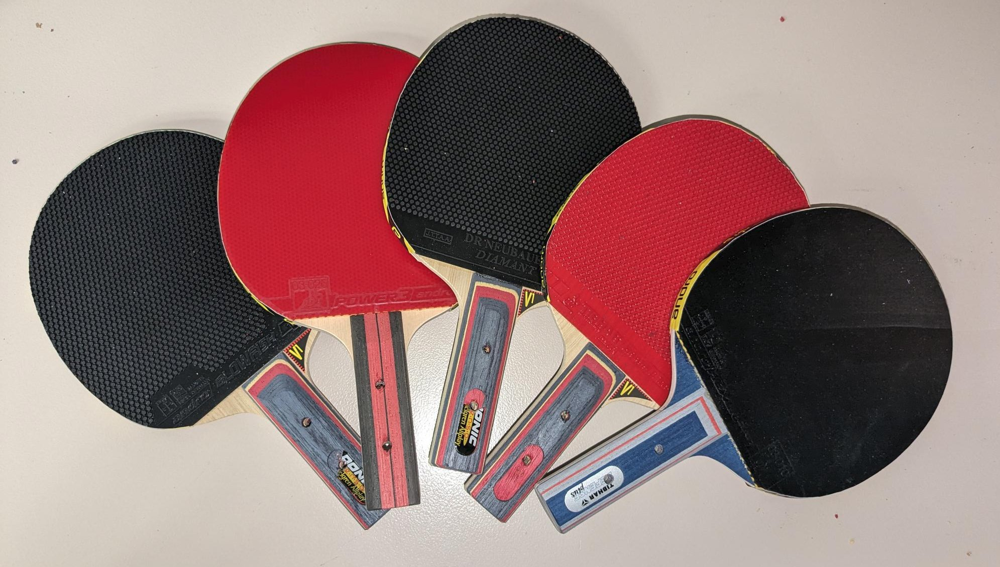

# Learning Racket-Ball Bounce Dynamics Across Diverse Rubbers for Robotic Table Tennis

<p align="center">
  <a href="https://arxiv.org/abs/2604.11349">
    
  </a>
  <a href="https://arxiv.org/pdf/2604.11349.pdf">
    
  </a>
</p>


Modeling racket-ball interactions in robotic table tennis across a wide range of rubber types.  
This work combines a physics-based contact model with Gaussian Processes to capture nonlinear, state-dependent bounce dynamics while preserving physical interpretability.


<p align="center">
  
</p>

---

## Contributions

- Dataset of racket-ball bounce events across 10 racket configurations  
- Analysis of rubber-dependent bounce dynamics and their dependence on impact conditions  
- Gaussian Process framework for learning state-dependent physical parameters with uncertainty estimates  
- Improved prediction accuracy of post-impact velocity and spin compared to standard baselines  
- Online adaptation of racket dynamics with few observations  

---

## Rackets used

#### Rubbers

| Name                       | Type                 |
| -------------------------- | -------------------- |
| Tibhar Grass D.TecS        | Long pips            |
| Dr. Neubauer Diamant       | Medium pips          |
| andro Blowfish             | Short pips           |
| andro Power 3              | Inverted (allround)  |
| andro Hexer Duro           | Inverted (offensive) |
| Dr. Neubauer A-B-S II soft | Anti-spin            |

### Blade
| Name                             | Type       |
| -------------------------------- | ---------- |
| DONIC Appelgren Allplay Senso V1 | Allrounder |
| Donic Holz Original Carbospeed   | Offensive  |
| Tibhar Holz Defense Plus         | Defensive  |

### Configurations

| Blade      | Sponge Thickness (mm) | Rubber               | ID |
| ---------- | --------------------- | -------------------- | -- |
| Offensive  | 2.1                   | Inverted (offensive) | 1  |
| Offensive  | 1.8                   | Inverted (allround)  | 2  |
| Defensive  | 2.1                   | Inverted (offensive) | 3  |
| Defensive  | 1.8                   | Inverted (allround)  | 4  |
| Allrounder | 1.2                   | Long pips            | 5  |
| Allrounder | 0                     | Long pips (OX)       | 6  |
| Allrounder | 1.2                   | Medium pips          | 7  |
| Allrounder | 2.0                   | Short pips           | 8  |
| Allrounder | 2.1                   | Inverted (offensive) | 9  |
| Allrounder | 2.1                   | Anti-spin            | 10 |

## Dataset

The dataset contains ball velocities and spin before and after bounce. It tries to cover different combinations of incident ball normal velocities and tangential velocities.

The dataset is in `data`. The included CSV files contain:

- `data/original`: 8,184 raw bounce events across 10 racket configurations.
- `data/train`: 6,490 samples used by the benchmark.
- `data/test`: 1,623 samples used by the benchmark.

The paper reports 8,194 recorded bounce events. The benchmark script uses the fixed train/test CSV files included in this repository.


## Benchmark

Install the Python dependencies from the repository root:

```bash
pip install -r requirements.txt
```

Run the paper benchmark on the fixed train/test splits:

```bash
python python/benchmark.py
```

Results are written to `results/benchmark`:

- `summary.md` and `summary.json` contain aggregate metrics across rackets.
- `per_racket_metrics.csv` contains metrics for each racket and method.
- `reports/` contains the per-method JSON reports.

To run a smaller benchmark:

```bash
python python/benchmark.py --methods parametric_constant --rackets 01 02
```

Add `--plots` to save diagnostic plots under `results/benchmark/plots`.


## Citation

```bibtex
@misc{gossard2026learning,
      title={Learning Racket-Ball Bounce Dynamics Across Diverse Rubbers for Robotic Table Tennis}, 
      author={Thomas Gossard},
      year={2026},
      eprint={2604.11349},
      archivePrefix={arXiv},
      primaryClass={cs.RO},
      url={https://arxiv.org/abs/2604.11349}, 
}
